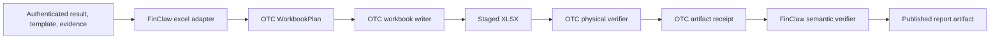

# OTC Excel Artifact Replacement Design

**Date:** 2026-09-13
**Status:** Proposed; awaiting review before implementation
**Owners:** Open Table Connector (workbook mechanics), FinClaw (financial semantics)

## 1. Decision

Open Table Connector (OTC) will become the reusable workbook-artifact
runtime currently embedded in `src/finc/analysis/excel.py`. OTC will provide
an explicit `excel-artifact/v1` capability for constructing a new `.xlsx`
artifact from a declarative plan and for independently reading back the
physical workbook. FinClaw will provide the adapter that turns authenticated
analysis results, templates, evidence, and chart assets into that plan.

This is a transfer of mechanics, not a transfer of financial meaning. OTC
must not import FinClaw packages, know metric IDs, interpret evidence status,
or decide where a financial value belongs. FinClaw remains authoritative for
source mappings, exact values, evidence and scope, chart-to-cell bindings,
and the report sheet layout.

During migration, FinClaw keeps the public `render_excel()` and
`verify_excel()` entry points. They delegate to OTC and retain their current
JSON-compatible receipts. Once the integration has passed the acceptance
matrix, direct `openpyxl` imports from `src/finc/analysis/excel.py` are
removed. Existing OTC `write_excel(table, path, sheet)` behavior remains
backward compatible.

## 2. Current contract and problem

The current FinClaw renderer creates a workbook containing one sheet per
report section, an `Exact values` sheet, and an `Evidence and scope` sheet.
Every intended value is written as literal text, formulas are disabled, chart
PNGs are embedded at deterministic anchors, and verification checks worksheet
order, literal coordinate coverage, image hashes, and the absence of formulas.
The renderer also derives expected placements from `place_cells()` and
rechecks chart mapping hashes. These semantic checks are valuable but are
coupled to workbook construction and raw XLSX parsing in one module.

OTC currently reads workbooks as Arrow tables and has a small generic table
writer. It does not expose multiple planned sheets, literal-cell plans,
formatting, image placement, or the raw physical readback required by the
FinClaw report contract. Simply calling the table writer from FinClaw would
discard the report layout and weaken evidence guarantees.

## 3. Target architecture



### 3.1 OTC responsibilities

OTC owns the generic, provider-neutral workbook artifact layer:

- validate a declarative plan before writing;
- create sheets in the requested order and apply deterministic names,
  dimensions, merges, freeze panes, print settings, and minimal styles;
- write literal strings without formula interpretation;
- embed bounded image bytes at one-cell anchors and report their content
  hashes;
- stage a new workbook without overwriting an existing destination;
- reopen the saved XLSX and inspect both decoded workbook objects and raw XML;
- reject formulas, external relationships, duplicate archive members,
  invalid coordinates, unexpected semantic cells, missing images, and image
  hash mismatches; and
- return machine-readable receipts and stable error codes.

OTC does not calculate formulas, execute Excel, render charts, inspect Gold,
or infer business semantics. It may retain its existing table-oriented writer
as a separate convenience API implemented on the same low-level primitives.

### 3.2 FinClaw responsibilities

FinClaw owns the semantic adapter and remains the only component that:

- maps an analysis result through a validated template;
- chooses section labels and report sheet contents;
- formats exact rational values, statuses, unavailable reasons, filters,
  evidence reasons, ranking selections, and source coordinates;
- validates chart mapping and chart asset hashes before embedding;
- constructs the `Exact values` and `Evidence and scope` projections;
- compares OTC's physical receipt with its expected semantic placement map;
  and
- publishes an artifact only after both OTC physical verification and
  FinClaw semantic verification succeed.

## 4. OTC `excel-artifact/v1` contract

The public API may use dataclasses or equivalent typed objects, but the
following concepts and fields are normative.

### 4.1 Workbook plan

`WorkbookPlan` contains an ordered tuple of `SheetPlan` values and writer
limits. A `SheetPlan` contains a unique requested name, column widths,
optional view/page settings, merge ranges, an ordered map of populated cells,
and image placements. A populated cell has an A1 coordinate, a literal string
value, and a style reference. A placement has a sheet name, a zero-offset
one-cell anchor, image bytes or a bounded file reference, and its expected
SHA-256 content hash.

The plan is closed: unknown fields are rejected, sheet names are non-empty,
cell values are strings no longer than Excel's 32,767-character limit, A1
coordinates are uppercase and unique per sheet, and image sizes are bounded
by the configured resource limit. Empty style-only cells are allowed but are
not semantic cells.

### 4.2 Write and verify operations

The capability exposes operations equivalent to:

```python
write_workbook(plan: WorkbookPlan, destination: Path) -> WorkbookWriteReceipt
verify_workbook(path: Path, expected: WorkbookExpectation) -> WorkbookVerifyReceipt
```

`write_workbook` creates a new staged XLSX and fails if the destination
already exists. It sets calculation mode to manual/no calculation and emits
the planned sheet order, semantic cell map, merge map, and image manifest.
The caller decides when a staged file becomes the published artifact.

`verify_workbook` reopens the file and checks the complete physical contract:
sheet order and names, literal cell type/value/coordinate coverage, merge
ranges, declared view/page properties, image sheet/anchor/hash coverage,
absence of formulas and external relationships, and duplicate archive
members. It returns `status`, `semanticHash`, `contentHash`, cell/image
counts, and the OTC capability identity. It never recalculates or silently
normalizes a mismatch.

### 4.3 Error and resource behavior

Invalid plans, path collisions, malformed XLSX archives, unsupported image
formats, formula cells, extra semantic cells, and hash mismatches produce
structured OTC errors with a stable capability code and credential-free
diagnostic context. Resource limits cover maximum sheets, cells, text bytes,
image bytes, and archive bytes. Limits are checked before parsing untrusted
workbooks where possible and are reported in the receipt.

## 5. FinClaw migration contract

The first FinClaw migration adds an internal translator from the existing
`sections` input to `WorkbookPlan` and converts the OTC receipt into the
current `expected` structure used by callers and replay. The translator must
preserve:

- section-name sanitization and deterministic collision suffixes;
- sheet order (`section sheets`, `Exact values`, `Evidence and scope`);
- literal text and `@` number format semantics;
- chart image dimensions and anchors;
- expected placement records and chart mapping hashes; and
- all existing error behavior that protects evidence and exact values.

`verify_excel()` remains a FinClaw semantic gate. It first asks OTC to verify
the physical artifact, then checks that each expected source coordinate,
metric, measure, status, rounded value, evidence field, and chart mapping is
present. A successful OTC receipt alone is insufficient for publication.

The FinClaw package may continue to depend on `openpyxl` indirectly through
OTC, but `src/finc/analysis/excel.py` must not import it after cutover. The
OTC package pin is updated atomically with the adapter change and all OTC
subpackages in `pyproject.toml` continue to resolve to one compatible
revision.

## 6. Compatibility and rollout

The work is delivered in four reviewed changes:

1. **OTC capability:** implement and test `excel-artifact/v1` without
   changing the existing table writer or Excel connector read path.
2. **FinClaw adapter:** add plan translation and receipt conversion behind
   the existing `render_excel()`/`verify_excel()` functions; pin the OTC
   revision.
3. **Parity and cutover:** run golden workbooks and corruption tests, remove
   direct `openpyxl` usage from FinClaw, and update package documentation.
4. **Retirement:** after one release with compatibility wrappers, document
   the wrappers as stable delegation shims and remove duplicated raw XLSX
   verification code.

No migration may publish an artifact when OTC or FinClaw verification fails.
Existing retained workbooks remain replayable; replay authenticates their
stored bytes and mappings and does not rerender or recalculate them.

## 7. Acceptance matrix

| Area | Required evidence | Pass condition |
| --- | --- | --- |
| OTC plan validation | Unit tests for names, coordinates, limits, text, images | Every invalid plan is rejected with a stable code |
| Literal safety | Raw XML fixtures with formulas, typed cells, duplicate coordinates | Verifier rejects all nonliteral or extra semantic content |
| Physical readback | Golden workbook with merges, styles, page settings, and images | Sheet/order/cell/merge/image manifests match exactly |
| FinClaw parity | Existing analysis Excel fixtures and receipts | `render_excel` and `verify_excel` preserve current semantic output |
| Corruption resistance | Mutated cell, image, relationship, archive, and mapping fixtures | Verification fails closed with actionable diagnostics |
| Compatibility | OTC table-writer and connector suites | Existing table write/read behavior is unchanged |
| Packaging | Clean install from one OTC revision | Feature capability is discoverable and importable |
| Publication gate | End-to-end staged write, dual verification, publish | No unverified XLSX receives a public artifact identity |

The previously requested human usability gate remains separate and pending;
this spec does not claim that human acceptance evidence exists.

## 8. Non-goals

This change does not move financial calculations, Gold binding, chart
generation, Dash, formula execution, workbook editing, remote spreadsheet
providers, or general BI/report semantics into OTC. It does not make XLSX a
source of truth for analysis results. It does not require byte-identical
XLSX output across library versions; the semantic manifest, content hash,
and renderer/capability identities provide the reproducibility boundary.
