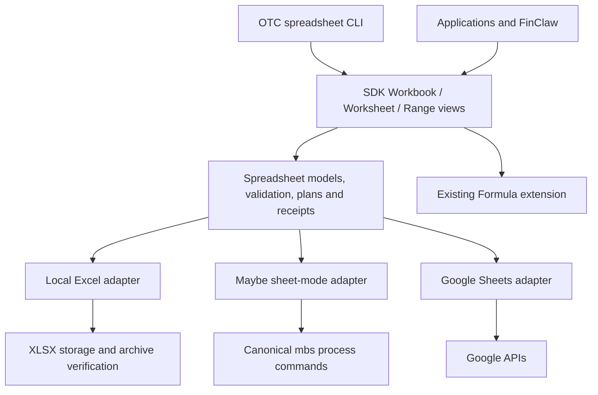

# Unified Spreadsheet Operations Enhancement

**Date:** 2026-09-13

**Revised:** 2026-09-14 — standard file URIs, direct-return SDK calls, and target-inferred formula dialects.

**Status:** Proposed architecture and requirements; implementation is not authorized by this document.

**Providers:** Local Excel `.xlsx`, Maybe Sheet sheet-mode, Google Sheets.

**Extension:** `spreadsheet`, with independently versioned operation capabilities.

## 1. Decision and scope

OTC will expose one optional spreadsheet extension for workbook lifecycle,
worksheet structure, cell ranges, formatting, styles, images, and related grid
operations. All three providers use the same public models, SDK views, command
grammar, planning rules, results, and capability discovery. Provider adapters
own transport, persistence, native representations, and physical verification.

The interface follows the resource-and-verb design of Maybe Sheet's canonical
CLI. It does not make Maybe's JSON payloads the portable contract. Excel and
Google Sheets must be first-class implementations, with no dependency on the
Maybe service or CLI.

“Full operation interface” means a coherent resource model covering spreadsheet
editing and inspection, including discovery of provider differences. It does
not promise every feature of the Excel desktop application or identical support
across providers. Unsupported operations and unsupported property values MUST
be rejected before mutation, with no silent omission or fallback conversion.

This spec covers API and CLI design, provider obligations, compatibility, and
acceptance. It does not implement the enhancement or migrate FinClaw.

## 2. Review of the previous requirements

This proposal supersedes the architecture in
[Excel artifact requirements](2026-09-13-excel-artifact-capability-requirements.md)
and [Excel artifact replacement design](2026-09-13-otc-excel-artifact-replacement-design.md).
Those documents remain historical inputs; their strict artifact guarantees are
retained as the `literal-artifact/1.0` profile described below.

| Previous requirement | Decision in this proposal |
| --- | --- |
| Excel-only workbook construction API | Replace with a shared spreadsheet extension and provider adapters |
| Declarative workbook plan | Replace the public plan API with resource operations and an internal change set |
| Local-only and create-new-only | Restrict to the literal artifact profile; general operations can edit existing workbooks and remote spreadsheets |
| Every value must be literal text | Retain for the artifact profile; general range writes also support explicitly typed scalar values |
| No formulas or calculation | Retain for the artifact profile; general formula operations delegate to the existing Formula extension |
| Layout, merges, styles, images | Promote to reusable resource operations and shared value types |
| Exact XLSX archive/image verification | Retain as an Excel-specific verification level; do not infer it from remote readback |
| Deterministic manifests, limits, bounded errors | Retain for all providers with declared verification scope |
| Backward-compatible Table reads/writes | Retain without changing signatures, typing, formula activation, or receipt shapes |
| FinClaw owns financial semantics | Retain; OTC never selects metrics, calculates financial results, or decides report composition |

The earlier standalone `excel-artifact/v1` spelling is a proposal, not the
operation identity convention used by current OTC code. New operations MUST
use `CapabilityIdentity(name, "1.0")`, such as
`spreadsheet.range.write/1.0`. If an artifact wrapper is subsequently shipped,
it MUST delegate to this extension rather than establish a second workbook
implementation.

## 3. Architecture alternatives

1. **Shared optional extension with granular capabilities — selected.** Defines
   common semantics once, allows typed provider-specific additions, and reuses
   the existing extension pattern. Capability and conformance work are required.
2. **Independent provider APIs with similar method names.** Easier initially,
   but differences in coordinates, style patches, receipts, and retries become
   caller responsibilities. Rejected because the architecture is not unified.
3. **Treat every provider as an XLSX import/export backend.** Reuses artifact
   code but turns small remote edits into document replacement and cannot
   promise preservation of native features or concurrent edits. Rejected.



### 3.1 Package ownership

- Add `open-table-connector-spreadsheets` under `packages/spreadsheets`, importing
  only neutral contract facilities and required neutral helpers. It owns frozen
  request/result models, capability details, provider protocols, style schemas,
  plan validation, and canonical hashing. It MUST NOT import provider packages,
  the SDK, `openpyxl`, or a network client.
- Existing local-files, maybe-sheet, and google-sheets packages implement the
  protocols. They reuse their existing credential and transport mechanisms.
- The SDK owns binding, resource views, and plan orchestration; the CLI is a
  parser and renderer over that SDK. Both load the extension lazily. Missing
  optional packages MUST NOT break ordinary Table or Formula imports.
- Keep the closed core `CapabilityManifest` wire shape unchanged. Operation
  identities fit its existing capability list. Rich, target-specific capability
  details belong to the new extension's versioned binding result.
- Follow Formula's existing optional binding approach. SDK formula convenience
  methods route to Formula; the shared spreadsheet package does not duplicate
  formula evaluation or mutation logic. Target-aware SDK conveniences resolve
  an omitted dialect before calling Formula; they do not translate expressions
  between provider dialects.

Adding Workbook, Worksheet, and Range views is an intentional extension of the
currently narrow SDK vocabulary. Implementation MUST update package-boundary
documentation. These views represent physical resources, not new logical Tables.

## 4. Resource model and addressing

`WorkbookTarget` identifies one local path or provider document URI. Creation
uses a separate `WorkbookCreateRequest`: local destination path, or remote
provider/container plus title. A document ID must not be invented before create.
Workbook listing requires an explicit local directory or provider container,
pagination, and bounds; it is not an unrestricted account scan.

Local Excel targets use standard `file:///absolute/path/model.xlsx` URIs (or
supported local paths). The registry resolves the Excel adapter from the file
format, using one shared routing policy for Table, Workbook and Formula binding.
This enhancement introduces no new Excel URI scheme. Existing `excel://` and
`xlsx://` aliases, where already supported, remain compatibility inputs; new
examples and emitted local workbook targets use `file://`. Worksheet selection
is a separate reference. Path/URI aliases for the same local file MUST share
canonical target identity, revision checks and mutation coordination.

`WorksheetRef` reuses the existing Formula public type where compatible.
Binding resolves an exact name or ID to one worksheet and returns its actual
name, ID, kind, workbook identity, and observed revision. If both name and ID
are supplied, both MUST match. Zero or multiple matches fail.

Maybe `gid` and Google `sheetId` are provider identities, not sheet positions.
Maybe Base worksheets can appear in workbook inspection but MUST be rejected
when binding this extension's grid operations. No implicit Base conversion is
allowed. Excel sheet IDs are only guaranteed within a bound workbook revision;
external replacement, rename, or structural changes require rebinding unless
identity continuity is positively established. Renaming must never silently
retarget a cached view to another worksheet.

`RangeRef` contains a bound worksheet and a finite inclusive A1 rectangle.
Internally, coordinates are positive one-based rows and columns; adapters own
zero-based/half-open conversion. Single cells normalize to a 1x1 rectangle.
External references, unions, unbounded `A:A`/`1:1` selectors, and ambiguous
worksheet-qualified strings are rejected in v1. Row/column operations accept
bounded inclusive dimension intervals instead.

Creation plans may use unique local worksheet keys. Execution resolves them to
created IDs for subsequent operations and receipts. Plan keys are never treated
as persistent provider IDs. Existing worksheet names MUST NOT be automatically
sanitized; creation can explicitly request deterministic sanitization and must
return the requested-to-actual mapping.

## 5. Capability contract and operation surface

Each operation below has identity `spreadsheet.<resource>.<verb>/1.0`; nested
verbs retain dots, for example `spreadsheet.range.note.set/1.0`. SDK methods and
CLI commands use the same vocabulary. Formula operations retain their current
`formula.grid.read/1.0`, `formula.grid.set/1.0`,
`formula.grid.values.read/1.0`, and `formula.grid.recalculate/1.0` identities.

| Resource | Defined operations | Contract |
| --- | --- | --- |
| workbook | list, inspect, create, copy, delete, import, export | Document lifecycle; create/import return actual identity; copy/import report preservation scope |
| worksheet | list, inspect, create, rename, copy, move, delete, config | Grid lifecycle, order, view and page properties |
| range | inspect, read, write, clear, search, copy, move, merge, unmerge, format, style | Bounded cell content and appearance operations |
| range.note | read, set, clear | Plain cell notes; threaded comments are distinct and outside v1 |
| row / column | inspect, insert, delete, move, config, format, style | Bounded dimension edits, sizing, visibility and appearance |
| image | list, read, insert, replace, set, delete | Embedded/anchored images with explicit identity and content evidence |
| named-range | list, inspect, create, update, delete | Workbook-scoped names resolving to one finite grid rectangle |
| validation | read, set, clear | Explicit rule schema; initial portable rules are list, numeric interval and date interval |
| conditional-format | list, set, delete | Identified ordered rules; initial portable rules are numeric comparison and text equality |
| filter | inspect, set, clear | Basic bounded filter, declared column predicates; named filter views are extensions |
| chart | list, inspect, create, update, delete | Optional native chart object; portable initial spec is line/bar with bounded data ranges |
| pivot | inspect, upsert, delete | Optional grouped/aggregated grid object with an explicit bounded source |
| workbook | write | Commit buffered resource operations with an explicit execution policy |
| workbook | verify | Compare an independent expectation against an explicitly scoped observation |

Operations are a versioned catalog, not an assertion that current adapters
implement them. A provider MUST advertise only implemented and tested
operations. Every unsupported catalog entry remains a structured rejection.

Binding returns supported identities plus per-operation details: target kinds,
allowed fields/enums, size bounds, formula dialects where applicable, native
versus emulated execution, preservation scope, revision enforcement,
idempotency strength, atomicity scope, and verification levels. Absence means
unsupported. A feature is enabled only when installed dependencies, target mode,
transport version, and required credentials permit it; provider permission
changes can still cause execution-time rejection.

The first usable release MUST provide worksheet list/inspect/create/rename,
range inspect/read/write/clear, and basic range format/style on all three
providers. It MUST also provide workbook inspect/create, worksheet config for
frozen panes, and row/column config for explicit size and visibility on all
three. Image support is required for Excel and Maybe when their validated
transport supports it; Google image support is explicitly conditional below.
Advanced catalog entries can arrive incrementally; documentation MUST publish
the actual per-provider capability matrix for each release.

## 6. Cell values and structural semantics

`range.read` returns a rectangular matrix preserving blank positions and cell
types, with separate stored value, formula text, calculated value, and displayed
text projections. Unavailable projections are marked unavailable, not fabricated.
Reads never treat row one as headers or silently convert a grid to an Arrow Table.

`range.write` accepts an exact-shape matrix of tagged strings, booleans, finite
numbers, or blanks. Missing cells and ragged rows are errors. Blank means clear
cell content; `""` is an explicit empty string and MUST be preserved or rejected
if the provider cannot distinguish it. Strings are literal, including those
starting with `=`, `+`, `-`, or `@`. No locale-based type inference is permitted.
Precision outside the target numeric representation MUST be rejected or supplied
as explicit text; dates use a declared date/time encoding and workbook epoch,
not an implicit serial conversion. Date/time writes are separately advertised.

General writes to existing formula cells replace their content intentionally.
Activating or editing a formula requires an explicit Formula operation; string
shorthand is normalized to FormulaExpression internally.
Number formatting must never activate formulas or mutate stored values.

`clear` requires explicit content/format/style/note components; content is the
default. `copy`/`move` require explicit components and destination rectangle.
Formula-copy semantics delegate to Formula capabilities; unsupported translations
fail. Overlapping moves are rejected in v1. Merge defaults to rejecting populated
non-anchor cells; discarding them requires an explicit request policy. Overlapping
merge ranges are rejected. Structural operations MUST declare and preserve their
reference-update scope for formulas, named ranges, charts, merges and images;
if that cannot be guaranteed, reject the affected operation before mutation.

Dimension move destinations use a one-based insertion boundary in the original
grid, before removal; insertion inside the source interval is invalid. Worksheet
move uses a zero-based final ordinal. Deleting the last visible grid worksheet
is rejected by the portable contract. All operations return resolved targets.

## 7. Format, style, and worksheet configuration

Format and style are shared value types applied through owning resources,
following Maybe's resource-local styling model:

- `CellFormat`: text, general, number, percent, currency, date/time, or an
  explicitly dialect-tagged native number-format pattern. Portable presets have
  declared locale, precision and rounding-display behavior. Unsupported native
  patterns must fail; provider pattern strings are not assumed interchangeable.
- `CellStyle`: font family/size/emphasis, foreground and fill colors, borders,
  horizontal/vertical alignment, wrapping and text rotation. Colors use sRGB
  `#RRGGBB`; font sizes use points. Theme references require an extension.
- `WorksheetConfig`: frozen row/column counts, gridlines, zoom, visibility,
  optional print area, paper, orientation, margins and fit settings.
- `DimensionConfig`: width/height in pixels at 96 DPI, hidden state, or explicit
  autofit. Excel character-width conversion must declare approximation and
  tolerance. Exact native dimensions are a provider-qualified option.

Style patches distinguish omitted fields (preserve), explicit reset paths
(restore provider default), and assigned values. Unknown fields, invalid reset
paths, and assigning/resetting the same field fail validation. Reads distinguish
explicit properties from effective defaults. A scoped style patch must preserve
unrelated style and format properties.

A `StyleDefinition` is an immutable, named plan-local bundle of format/style
properties; `style` applies the bundle, while `format` applies number/display
format only. Styles are expanded at planning time. V1 does not require a remote
named-style registry or change earlier cells when a local definition changes.
Worksheet presets compile into ordinary config/style operations. No provider
beautification heuristic is silently substituted for specified properties.

## 8. Images and optional richer objects

`ImageSpec` contains bounded PNG/JPEG bytes, MIME type, SHA-256, anchor cell,
pixel offsets, pixel dimensions and alternative text. Byte sources are explicit
caller-provided bytes/files; an adapter MUST NOT publish them to public hosting
as an implicit transport step. The initial anchor is one-cell; two-cell and
in-cell images are separate advertised features. An `IMAGE()` formula is not
an embedded-image substitute.

`insert` always creates and returns a new object ID; `replace` changes bytes of
an existing ID while preserving placement; `set` patches an existing ID's
placement/metadata; `delete` requires a resolved existing ID. Address-only
selection must resolve exactly one image. List/read distinguish metadata-only
inspection from retrieval of stored bytes. A submitted hash is never described
as a readback hash. Provider-transcoded images require separate input/stored
hashes and fail a profile requiring byte preservation.

Google's Sheets API documents positioning existing embedded objects, but that
alone does not establish a portable image upload/readback path. The initial
Google adapter MUST leave unsupported image capabilities absent. A future
bridge, such as explicitly configured Apps Script, requires separate installation,
authorization, transport versioning and conformance before enabling them. It
does not change the shared image API. See the official
[request catalog](https://developers.google.com/workspace/sheets/api/reference/rest/v4/spreadsheets/request).

Charts and pivots use native structured objects, not generated chart PNGs.
Unsupported chart types, aggregations or features fail explicitly. Arbitrary
dashboard construction, VBA, macros, script execution, sharing/ACL management,
version-history restoration and Base-mode administration are outside this v1.
They must not enter through arbitrary unvalidated provider payloads.

## 9. Sessions, execution, concurrency, and receipts

Workbook resource operations build an internal ordered change set. No public
SpreadsheetPlan, WorkbookPlan or SheetPlan is required. `book.write()` validates
targets, capabilities, properties, asset hashes and limits, then commits the
buffered changes. `book.write(dry_run=True)` performs preflight reads and returns
projected effects without mutations; it does not guarantee that remote state or
permissions will remain unchanged. Internal normalized change-set hashes support
receipts and idempotency without exposing a caller-authored plan language.

`write()` revalidates dependencies and targets, then executes in order. Batch
optimization MUST preserve order and observable effects. Default execution
policy requires one atomic mutation boundary; providers reject multi-step plans
that cannot meet it. Callers may explicitly allow partial execution. Preflight
cannot remove runtime failures; partial mode stops on first failure and returns
per-operation results, created IDs and completed effects. It does not attempt
unrequested compensating deletions or claim rollback.

Google `spreadsheets.batchUpdate` can provide a boundary for the requests within
that call; document creation, other endpoints, or multiple batches are not one
transaction. Concurrent collaborators may change subsequent observations. See
[batchUpdate semantics](https://developers.google.com/workspace/sheets/api/reference/rest/v4/spreadsheets/batchUpdate).
Maybe capabilities must derive from tested command/transport guarantees, not
from a JSON `ok` field. Excel can stage/save a file, but must describe the actual
filesystem publication and concurrency guarantees.

Every mutation supports optional `expected_revision` and `idempotency_key`.
Revision details distinguish provider compare-and-set, an observed/preflight
check, and unavailable enforcement. A content/observation hash alone is not a
remote compare-and-set token. Required atomic revision enforcement MUST be
rejected when unavailable. Rebinding and plan hashing include the actual target.

Idempotency keys bind provider, target, operation and normalized payload hash.
Reusing a key with a different payload fails. Host-ledger deduplication declares
its lifetime and cannot promise cross-process exactly-once execution. A timeout
after dispatch produces unknown commit state unless independent evidence settles
it; create/append/insert MUST NOT be blindly retried.

Results follow the existing Formula distinction between outcome, commit state,
and verification state. Spreadsheet results add per-operation results for plans.
An operation may be committed while verification fails or is unavailable.
Receipts include capability/version, operation and request IDs, resolved targets,
plan/payload hash, before/after revision evidence, affected bounds, created IDs,
normalizations, commit/verification state and verification scope. Public receipts
contain hashes and counts instead of a duplicate full cell payload; callers can
retain a separate explicit expectation manifest. Errors are credential-free and
bounded, using stable codes for unsupported capability/property, invalid request,
target mismatch, limits, stale revision, collision, preservation failure,
protocol failure, uncertain mutation and verification mismatch.

The literal artifact profile additionally returns its full semantic cell, merge,
image and sheet-order manifest as required by original R9. Its receipt references
that manifest and its hash. This explicit artifact output is distinct from
routine operation diagnostics and must not be copied into error contexts.

Limits cover sheets, cells, operations, pagination, request/response bytes,
text/image bytes, timeouts, archive members and decompressed archive bytes.
Whole-workbook inspection and verification must fail as incomplete when bounds
are exceeded; a truncated observation cannot pass complete verification.

## 10. Excel persistence and literal artifact profile

General Excel editing supports existing `.xlsx` files only within an advertised
preservation envelope. Preflight detects unsupported workbook features that may
be dropped by the selected engine and rejects edits rather than silently losing
them. Save into a sibling staging file, verify required properties, then publish
using the declared storage policy. Existing-file replacement requires an explicit
replace policy; source revision protection must state whether it guards only
cooperating OTC writers or all writers. Atomic file replacement is not by itself
atomic compare-and-set. Never claim stronger concurrency than the storage layer.

Workbook session state contains ordered worksheets, literal/typed cells, styles,
merges, configuration and images built through resource operations. A fresh-artifact execution can build
an entire local workbook in staging and publish it as one create-exclusive effect.
Remote create-and-populate usually needs explicit partial execution or a provider
staging facility; a partial remote artifact is returned as incomplete.

`literal-artifact/1.0` is a strict profile over workbook session operations. The Excel adapter
MUST retain requirements R1–R16 from the original requirements, specifically:

- create-exclusive destination, nonempty ordered sheets, deterministic requested
  sanitization, case-insensitive uniqueness and Excel length/name validation;
- literal strings only, `@` number format, at most 32,767 characters per cell,
  exact coordinate coverage and no formula elements or calculation-on-open;
- declared style/layout/merge equality, zero-offset one-cell images with exact
  stored-byte hashes, bounded archives, and a stable semantic manifest hash;
- independent decoded and raw XLSX verification, including duplicate ZIP members,
  invalid/duplicate coordinates, relationship violations, external worksheet
  relationships, unexpected semantic cells and image tampering;
- fail-closed verification without repair, and cleanup only of staging resources
  demonstrably owned by the failed operation, never pre-existing destinations.

`workbook.verify(expected, level)` supports `provider-readback` and
`xlsx-physical`. An expectation is supplied independently of mutation success.
It identifies complete-workbook versus selected-resource scope, properties,
expected cells, merges and images. The verifier independently observes actual
state; it MUST NOT build both expected and actual from the same write response.
It reports passed only when every required check completes at the requested
level. Provider readback does not establish raw archive integrity or a snapshot
unless the provider guarantees one. Export verification authenticates the exported
bytes only, not the live remote workbook. Remote providers MUST NOT advertise
the strict artifact profile without satisfying every profile requirement.

FinClaw translates its existing report layout to this plan/profile and retains
its own semantic gate. Its existing `render_excel()`/`verify_excel()` contracts,
source mappings, metric values, image bindings and publication rules remain as
specified in the earlier design. Ordinary spreadsheet editing is independent of
that application-specific migration.

## 11. SDK and CLI proposal

The following are proposed interfaces, not currently executable examples:

```python
book = client.workbook("file:///absolute/path/model.xlsx")
sheet = book.worksheet(name="Report")
cells = sheet.range("A1:B2")
cells.write([["Metric", "Value"], ["Revenue", 1200]])
sheet.range("A1:B1").style(bold=True, fill="#183245")
sheet.range("B2").format(kind="number", precision=2)
sheet.images.insert("/absolute/path/chart.png", anchor="A6", width=850, height=400)
grid_formulas = sheet.formulas()
grid_formulas.set("B3", "=B2*2")
book.write()
```

### 11.1 Direct returns and explicit formula intent

New Spreadsheet SDK methods return their typed value directly: workbook and
worksheet binding return views, reads return observations, and writes return
mutation summaries. No `unwrap()` or `require_value()` is needed. Rejected,
failed, partial or uncertain executions raise `OTCError` retaining the full
operation result, including commit state and verification evidence. A verification
failure must not become an ordinary successful return merely because mutation
committed. Validation can return a validated plan, but must never imply execution.

The SDK still uses structured OperationResult internally. A successful returned
mutation summary exposes `.with_results()` to retrieve the full result for that
already executed operation:

```python
sheet.formulas().set("C2", "=A2+B2")

# Alternative when details are needed; each set invocation performs one write.
result = sheet.formulas().set("C2", "=A2+B2").with_results()
```

`.with_results()` is a post-operation accessor, not a mode switch. It performs
no I/O, never retries, and never executes another write or fresh verification.
Repeated calls return the same captured result evidence. Each summary is bound
to its own operation; later calls on the worksheet cannot overwrite that evidence.
Returned observations and plan/verification summaries support the same accessor.
Bound views may expose their binding result through this accessor, but MUST NOT
store a mutable "last operation result". Their binding evidence remains specific
to the bind call even as the view tracks newer revisions.

Failure still raises from `set(...)` before `.with_results()` can be reached.
`OTCError.result` carries the full failed, partial or uncertain result, including
whether a mutation committed. This syntax does not offer a non-raising execution
mode. The CLI calls the internal structured-result execution layer before the
public exception adapter so that it can render both success and failure envelopes.
Provider wire schemas remain unchanged; the SDK attaches captured result metadata
to its typed return objects without serializing recursive object references.

Existing Table methods and `client.formulas(...)` retain their current result
contracts and `require_value()` for compatibility. The new `sheet.formulas()`
returns a direct-return Formula facade over the existing Formula view whose
returned objects expose `.with_results()`. This is return-shape adaptation, not a second
formula implementation. Adding a direct-return facade for legacy Table APIs can
be a separate additive change; this spec does not silently change their returns.
The previously proposed `unwrap()` alias is no longer required.

Extend the SDK Formula view's `set` convenience to accept either a string or the
existing fully specified `FormulaExpression`. Calling `formulas.set(...)` is
already explicit formula intent, so a string there is an expression. By contrast,
Table and `range.write(...)` strings remain literal values.

For string input, the bound target selects its advertised default dialect, or
its sole supported dialect when no default is declared. With no unambiguous
supported selection, reject before mutation and ask the caller to provide an
explicit dialect. Never infer dialect from formula text or translate it to
another language. Excel normally resolves to `excel-a1`, Maybe sheet-mode to
`maybe-sheet-a1`, and Google Sheets to `google-sheets-a1`. Base field formulas
retain separate bindings and cannot inherit a grid default.

An optional keyword supports advanced use:
`grid_formulas.set("B3", "=B2*2", dialect="excel-a1")`. An explicit dialect must
be advertised by the binding. Supplying both a typed FormulaExpression and a
separate dialect is rejected as redundant/ambiguous. Existing calls with
`FormulaExpression(text, dialect)` remain valid.

The SDK normalizes shorthand to the existing fully specified FormulaExpression
before validation, hashing, idempotency or provider dispatch. The standalone
FormulaExpression constructor and existing provider wire schema keep their
required dialect: an unbound expression has no target from which to infer it.
Internal change sets retain explicit target/dialect/text after normalizing
shorthand. A change of
target or dialect invalidates that normalized change set rather than silently retargeting
the expression. Legacy Formula wire payloads do not acquire optional fields.

### 11.2 Shared-file behavior

Worksheet Formula views refer to the same physical workbook as range operations.
Their delegated writes MUST use common provider mutation coordination and
revision evidence. A successful mutation refreshes or invalidates sibling views'
observations; externally changed identities require rebinding. This does not
create a transaction across separate API calls. Mixed formula/value plans must
declare whether both operations can participate in one storage transaction and
reject an atomic plan when the delegated execution cannot guarantee that boundary.

Current Excel Table writing remains a whole-workbook creation/replacement path,
not a range patch. Documentation MUST explain that it can replace existing
formulas/layout. Excel Table reads observe cached values and cannot establish
fresh calculation after a formula write. New Spreadsheet views must not conceal
either behavior. The strict literal-artifact profile continues to reject formulas.

### 11.3 CLI

`client.workbook.list(provider=..., container=...)` owns bounded listing.
`client.workbook.create(uri, ...)` starts creation at a local destination;
remote creation uses `client.workbook.create(provider=..., container=..., title=...)`.
`client.workbook(uri)` opens an existing workbook. Use resource-local verbs
consistently with `book.worksheet.create(name)`; do not introduce mode flags or
alternate `create_workbook`/plural creation APIs. The default-client `otc.workbook`
accessor exposes the same call, create and list operations.
`book.write(...)` and `book.verify(...)` follow the direct-return and
post-operation `.with_results()` convention. The session lifecycle below is
authoritative: edits are buffered and `write()` is the explicit commit operation.
No public `book.plan()`, `validate()` or `apply()` API is introduced.

Use an additive `otc spreadsheet` CLI namespace to avoid conflicts with existing
Table commands. Resource groups mirror Maybe's canonical surface:

```text
otc spreadsheet workbook inspect --target TARGET
otc spreadsheet worksheet list --target TARGET
otc spreadsheet worksheet create --target TARGET --name Report
otc spreadsheet range read --target TARGET --worksheet-name Report --range A1:B2
otc spreadsheet range write --target TARGET --worksheet-name Report --range A1:B2 --values values.json
otc spreadsheet range style --target TARGET --worksheet-name Report --range A1:B1 --spec header.json
otc spreadsheet range format --target TARGET --worksheet-name Report --range B2 --spec currency.json
otc spreadsheet image insert --target TARGET --worksheet-name Report --spec image.json
otc spreadsheet workbook write --target TARGET --commands operations.json --dry-run
otc spreadsheet workbook write --target TARGET --commands operations.json
```

CLI input files use the same versioned operation schemas as SDK requests, with local file
references resolved to bounded assets before planning. `--output json` returns
the same result envelope. A standalone mutating CLI command opens a session,
queues the requested operation, and calls write once before returning. The
multi-operation command file is a sequence of the same resource commands, not
a separate workbook-plan schema. `--dry-run` runs preflight only. Delete/clear commands
require explicit component/scope flags and noninteractive `--yes`; that flag does
not bypass capability, revision, preservation or validation checks.

### 11.4 Maybe mapping and intentional differences

| OTC surface | Current canonical Maybe CLI design |
| --- | --- |
| workbook lifecycle/inspect | `mbs workbook ...` |
| worksheet lifecycle/config | `mbs worksheet ...`; create explicitly selects Sheet engine |
| range values/merges | `mbs range read/write/clear/merge/unmerge` |
| range/row/column style | Resource-local `style --spec` |
| format | Normalize through canonical resource style/format support; do not invent an `mbs range format` command |
| row/column structure/config | `mbs row ...`, `mbs column ...` |
| formula | Existing Formula adapter; canonical `mbs formula ...` vocabulary |
| image | `mbs image list/read/insert/replace/set/delete` |
| notes | `mbs range note ...`; current set/clear are single-cell operations |
| charts/pivots | Translate only the tested subset of `mbs chart ...` / `mbs pivot ...` |

The current OTC connector still has legacy `excel-worksheet` paths, and the
Formula bridge contains `--uri` commands. The new adapter MUST negotiate or pin
a tested canonical CLI contract and use supported `--target`/JSON forms. This
spec does not assume all installed CLI versions accept the latest syntax.
Existing Table/Formula routes require explicit compatibility tests before any
transport migration. Multi-cell note set/clear must be rejected or explicitly
planned as multiple single-cell effects with honest atomicity.

## 12. Delivery and acceptance

Deliver the architecture in reviewed increments; each increment keeps existing
Table and Formula behavior working:

1. Shared package, schemas, capability binding, result model, SDK/CLI discovery,
   reference fake provider and cross-provider conformance fixtures.
2. Required common operation subset on all three adapters, with typed values,
   format/style patches, config and independent readback.
3. Structural editing, plans and Excel preservation; Excel/Maybe images with
   published Google support gaps and no hidden bridge requirement.
4. Literal artifact profile, corruption fixtures and FinClaw migration contract.
5. Additional catalog operations enabled only after provider conformance; chart,
   pivot and richer formatting support must publish their supported subsets.

| Acceptance area | Required evidence |
| --- | --- |
| Unified contract | Same serialized requests and logical observations exercised against Excel, Maybe and Google; transport-specific fixtures remain adapter-owned |
| Capability truthfulness | Every advertised operation has positive conformance; missing operation/property rejects before dispatch; Base grid binding fails |
| Identity | Duplicate names, rename, delete/recreate, stale binding and Maybe mixed-mode workbook cases cannot retarget operations |
| Cells | Rectangular blanks/empty strings, literal formula-looking text, numeric limits and explicit formula activation verified by independent reads |
| SDK conveniences | Direct calls execute once and return typed values; `.with_results()` performs no I/O and preserves operation-specific evidence across subsequent calls; failures raise with complete results before accessor execution; legacy return contracts remain unchanged; shorthand resolves through binding and ambiguous/unsupported dialects fail before dispatch; normalized explicit/shorthand requests hash identically |
| Shared local targets | File URI/path/legacy aliases resolve to one workbook identity; range and formula mutations invalidate stale observations and share coordination; Table replacement behavior remains documented |
| Formatting | Patch/reset/default behavior, unrelated-property preservation, number-format dialect rejection and dimension tolerance covered |
| Structure | Off-by-one dimensions, overlapping moves/merges and formula/named-range/image reference preservation covered |
| Images | Insert/replace/set/delete identity and anchor tests; actual stored-byte hashes where claimed; missing Google support rejected |
| Mutation outcomes | Atomic rejection, allowed partial batch, dispatched timeout, stale revision, duplicate idempotency key and readback failure preserve honest commit state |
| Artifact profile | All original R1–R16 tests, archive corruption, exclusive-create races, cleanup ownership and FinClaw semantic parity |
| Verification scope | Truncation, remote concurrent edit, unavailable property and provider image transcoding cannot pass a stronger verification level |
| Optional installation | Core SDK/CLI/Table/Formula work without new provider dependencies; missing spreadsheet dependencies return structured unsupported results |
| Compatibility | Existing Table, Formula, connector and provider-independence suites remain green; no change to existing `write_excel` behavior |
| Public usability | SDK and CLI examples create, inspect, write and style the same small workbook on every baseline provider; published capability matrix matches discovery |

Recorded transports are required for deterministic CI. Before advertising a
remote feature in a release, run a scoped live test against disposable resources
for the pinned transport/API and record its revision and date. Unavailable live
credentials mean missing release evidence, not a fabricated passing result.

## 13. Cross-provider lifecycle and completeness gates

This section resolves earlier lifecycle and API ambiguities and takes precedence
over descriptions of direct provider mutation elsewhere in this document.
It applies to local Excel, Maybe sheet-mode and Google Sheets. The accepted
scope is explicitly supported spreadsheet operations, not complete parity with
every feature of the Excel desktop application.

### 13.1 One public editing lifecycle

`client.workbook(uri)` opens an existing workbook. `client.workbook.create(...)`
starts a new workbook session; remote creation takes provider/container/title
until a real document URI is assigned. Both forms buffer edits. Worksheet,
range, formula, style and image mutations affect the same session; only
`book.write()` persists them. There is no save on close or garbage collection.
Queries reflect queued edits where supported; unsupported previews fail explicitly
rather than presenting stale persisted values as the edited state. Inspection
labels its observation as session or persisted state. `book.verify()` compares
persisted state with a captured expectation and rejects dirty sessions.

A successful write clears committed changes, updates binding/revision evidence
and leaves the general workbook editable for another write. The first local
create uses no-clobber publication; later writes update the bound artifact with
revision and preservation checks. The literal-artifact profile alone seals after
its first successful write to preserve immutable report-output semantics.

Queueing returns planned/not-started results; the write result describes actual
commit and verification state. Direct-return adaptation must accept a validated
planned result for a queued edit without misclassifying it as an executed write.
Existing legacy Table methods and `client.formulas(...)` retain their existing
immediate behavior. Documentation explicitly distinguishes them from workbook
session views; all file writes must share target identity and coordination.

For remote providers, the session is a bounded overlay, not an unbounded download
of the entire workbook. Preflight determines the complete write request sequence.
Atomic is the default write policy; unsupported multi-request atomicity is rejected
before dispatch. `book.write(allow_partial=True)` explicitly permits ordered
remote operations with per-operation effects. Creation is delayed until write;
a remote create-plus-populate sequence needs this opt-in unless the provider
supplies one atomic boundary. A partially created document returns its real URI.
Unknown or partial writes freeze further mutation until explicit reconciliation
settles their effects. No automatic replay of insert/create/delete is permitted.

Formula set/read in session views must operate against that overlay, including
unsaved worksheets. Reuse Formula validation/dialect/copy-fill helpers and typed
requests, but do not invoke its existing immediate file/network writer while
queueing. On write, translate the normalized formula operations into the same
storage transaction as value edits. Explicit provider recalculation is a separate
persisted operation requiring a clean session and an advertised capability.
No adapter computes formula values locally or presents old caches as recalculated
results. Maybe supports its tested recalculation scopes; Google and local Excel
must not advertise explicit recalculation without a validated engine/transport.

### 13.2 Minimum general manipulation contract

The artifact gate and the general-editing gate are independent. General editing
cannot be declared complete just because artifact generation passes, or because
unimplemented features return unsupported. Each release publishes an operation
matrix with implemented, unsupported and deferred entries for all three providers.

| Area | Required general-editing evidence |
| --- | --- |
| Existing documents | Open/edit/write/reopen; unrelated cells, sheets, formulas, layout and supported objects preserved; stale revisions rejected according to declared enforcement |
| Structure | Sheet creation/rename/reorder/copy/delete; row/column insert/delete/move; exact updates or preflight rejection for affected formulas, merges, images and named ranges |
| Values | Read/write/clear/copy/move, finite ranges, blanks versus empty strings, literal formula-like text, numeric precision and explicitly encoded dates |
| Appearance | Style/format patches and resets, dimensions, frozen panes, merges, visibility; print properties when the provider exposes them |
| Ordering and discovery | Bounded search and sort; ascending/descending keys, header exclusion, stable ties, blank placement, and range/object boundaries explicitly defined |
| Formula | Session binding before first save; typed/string equivalence; copy-fill relative/absolute references; cache state; clean-session provider recalculation when available |
| Grid objects | Native tables, named ranges, filters, validation, conditional formatting, images, charts and pivots each have an explicit supported subset and preservation policy |
| Links and protection | Hyperlink inspect/set/clear and sheet/workbook protection inspection; mutation only for the explicitly supported provider subset |

Add `spreadsheet.range.sort/1.0`, resource-local hyperlink read/set/clear,
protection inspect/set/clear and worksheet visibility to the catalog. Native
spreadsheet tables are grid objects with names/ranges/header/filter metadata;
they are distinct from the existing OTC tabular Table view and Maybe Base records.
Unsupported native table/protection features must be documented as gaps, not
silently replaced by plain ranges or local flags. Advanced object changes require
versioned provider-specific schemas where portable semantics cannot be defined.

The common three-provider baseline includes existing-workbook editing, finite
range values, worksheet lifecycle, row/column sizing and visibility, basic
style/format/merges, sorting, and formula expression operations. A provider must
pass that baseline before it is labeled general-editing ready. Native objects,
links, print and protection features have separate feature gates; missing support
prevents a claim of full catalog coverage but not a clearly labeled baseline release.

### 13.3 Mandatory semantics and preservation matrix

Sorting uses a bounded rectangular range and declared header rows, ordered keys,
ascending/descending direction and explicit blank placement. Preserve original
row order for ties. The affected formula/reference/merge behavior is part of the
capability; reject sorting an unsupported merged or reference-sensitive structure.

Numeric writes must not silently round integers outside the provider's exact
representation. Dates declare date/datetime, timezone interpretation and the
workbook epoch, including Excel's 1900/1904 distinction and serial-60 behavior.
Cached formula values carry fresh/provider-current/stale/unavailable evidence as
supported; literal reads do not turn a cache into a calculation guarantee.

Each provider publishes a tested matrix for formulas, tables, names, images,
charts, pivots, hyperlinks, notes, validations, conditional formatting, protection,
hidden/very-hidden sheets, external links, macros and unsupported package parts.
Each entry states: mutable with verified preservation, preserved without mutation,
or rejected before write. A feature merely absent from the mutation API may not
be silently discarded during an unrelated write. Maybe Base worksheets in a
mixed-mode document must remain untouched; grid operations bind only sheet-mode.
Google native objects and collaboration state cannot be replaced wholesale by
an XLSX import/export shortcut. Local Excel must preflight its archive before
using an engine known to drop unrecognized parts.

### 13.4 Three-provider acceptance gate

Run the same logical operation fixtures on Excel, Maybe sheet-mode and Google,
with adapter-specific transport recordings and expected differences declared.
Require create/edit/save/reopen, unsaved formula/value composition, preservation,
stale bindings, unsupported-property rejection, partial/unknown commits and
same-operation `.with_results()` evidence. Remote live conformance requires an
explicit test account and disposable documents with recorded transport versions;
recordings alone cannot establish live parity or atomicity. Missing live evidence
keeps that provider's release gate pending.

The local FinClaw artifact gate remains R1–R16 plus FinClaw semantic, failure
retention and replay tests in the readiness spec. Remote image or print gaps do
not weaken that local gate, and a passing local gate does not imply remote parity.

## 14. Source baseline

Reviewed OTC revision: `bbf7795d0babad8d451acd258f0ff8fd4242ae90`.

- Existing `packages/contract/.../capabilities.py` and `plugins.py`: closed
  manifest and provider-neutral registration.
- Existing `packages/formulas`: capability identities, resource binding,
  independent readback, and separate outcome/commit/verification states.
- Existing `packages/local_files/.../excel_writer.py`: literal string Table
  writes, plus `excel_formula.py` for current archive preservation behavior.
- Existing `packages/maybe_sheet` and `packages/google_sheets`: current table
  and Formula integration points; their READMEs describe current public support.
- Maybe CLI local repository, clean revision
  `006d7b8d9c828928a25c0864b437fafd4ada2629`: `README.md` command tree and
  `src/maybeai_sheet/commands/image.py`. These establish the design reference,
  not proof that every operation already exists in OTC.
- Official Google [request catalog](https://developers.google.com/workspace/sheets/api/reference/rest/v4/spreadsheets/request)
  and [batchUpdate reference](https://developers.google.com/workspace/sheets/api/reference/rest/v4/spreadsheets/batchUpdate),
  consulted 2026-09-13 for adapter boundaries.
