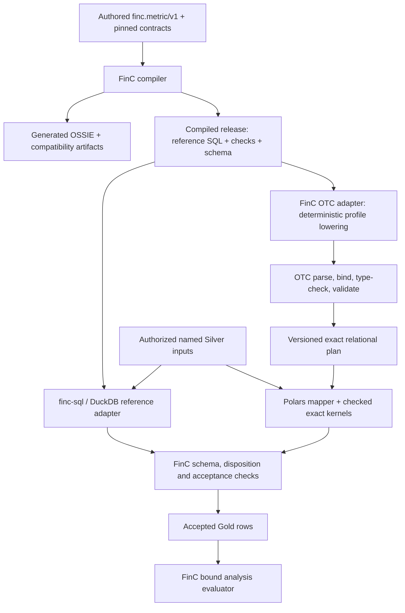

# Portable SQL expansion for exact metric execution

**Date:** 2026-09-15

**Status:** Proposed design; no implementation, certification, or FinC cutover is implied.

**Scope:** A versioned OTC portable relational profile for typed expressions, conditional aggregation, exact arithmetic, and verifiable output, with a FinC Gold adapter acceptance contract.

## 1. Decision

Expand OTC's portable relational plan and its local Polars evaluator to support the Gold expression requirements in section 9, **Typed metric catalog and generated OSSIE**, of the FinC configuration-authority consolidation design. Preserve the existing SQL lane and SDK vocabulary. Introduce an explicitly selected `exact-relational/1.0` profile; existing callers retain their existing behavior.

OTC owns portable query semantics, type checking, execution, resource enforcement, and neutral execution evidence. FinC owns business metric semantics, authored definitions, compilation, disposition algebra, release eligibility, and publication. No OTC package imports FinC or Apache OSSIE.

Polars remains the first local evaluator. Exact arithmetic may require OTC-owned checked kernels rather than direct use of Polars defaults. DuckDB execution and provider pushdown are separately certified implementations, not prerequisites for the language expansion. DuckDB through the real `finc-sql` step remains the FinC Gold reference adapter until release-specific parity authorizes an OTC adapter.

## 2. Reference and precedence

The controlling consumer reference is the sibling repository's [configuration-authority consolidation design, section 9](../../../../finclaw-ng/docs/superpowers/specs/2026-09-15-configuration-authority-consolidation-design.md#9-typed-metric-catalog-and-generated-ossie).

Reference inspected on 2026-09-15:

- Repository: `finclaw-ng`; checkout HEAD `a0ae8e305d0270c2f4dab29dddb977a5d4e532af`.
- Document SHA-256: `129450700724f4908c17d2a196c2c787f699def9bbbff24ea3ea85a0ecac3b56`.
- The file digest identifies the inspected working-tree document; the checkout revision alone does not assert that its content is committed.

Related OTC specifications are the [Python SDK design](2026-08-31-python-sdk-design.md), [portable time-series design](2026-08-29-portable-time-series-storage-design.md), and [deferred DuckDB executor design](../../reviews/2026-08-31-duckdb-local-executor-reference.md).

This proposal extends the relational profile only. It does not silently revise FinC section 9.7, its selected execution stack, its M0 arithmetic gate, or OTC's temporal profile. If measured arithmetic behavior conflicts with the reference, record a failing fixture and resolve the FinC design before activation. Engine behavior does not override the consumer contract.

## 3. Verified baseline

OTC checkout inspected: `2720d661d35b8d211b29271008510f9ee1e04416`.

- [sql.py](../../../packages/sdk/src/open_table_connector/sdk/sql.py) parses portable SQL into private relational plan records and executes through `PolarsPlanMapper`.
- `_AggregateExpr` accepts a column argument. `SUM(CASE ...)` cannot lower.
- Scalar expressions accept columns, literals, and parameters; general arithmetic and conditional expressions are absent.
- Projections accept columns and simple aggregates. Global aggregation without `GROUP BY` is rejected by the mapper.
- [query.py](../../../packages/sdk/src/open_table_connector/sdk/query.py) provides deferred queries, plan/definition hashes, bound sources, parameters, and limits. Existing hashes must not be reinterpreted as input-content or bound-request identities.
- `Client.sql(...)` executes immediately and returns `OperationResult[pl.DataFrame]`; `prepare_sql(...)` produces a deferred `Query`.
- SQLite and PostgreSQL implement native SQL reads, but native execution is not portable semantic certification.
- The closed connector capability manifest has no release-specific FinC activation record.

These are code-inspection findings. This document does not report new execution tests or prove the historical metric corpus is supported.

## 4. Reference requirement traceability

| FinC section | Requirement | OTC delivery or explicit consumer responsibility |
| --- | --- | --- |
| 9.1–9.2 | Historical inventory, identity conflicts, aliases, supersession | FinC catalog/compiler; OTC must not resolve dotted metric IDs |
| 9.3 | Typed YAML authority, generated OSSIE/FINCLAW, appended `metric_id`, byte-identical pack round-trip | FinC generator gate; OTC executes compiler-produced projections and validates their declared schema |
| 9.4 | Closed expression allowlist | OTC supports the required generic subset; FinC retains its narrower tier policy and diagnostic mapping |
| 9.5 | Immutable compiled release and context-bound analysis plan | FinC owns both interfaces; adapter binds a versioned OTC query artifact to the same release |
| 9.6 | Named in-memory Silver, one read-only SELECT, checks/schema/hashes | Exact profile supports named inputs and verifiable results; FinC retains Frictionless integration and acceptance checks |
| 9.7 | Adapter activation after exact parity | Two gates: OTC profile certification and FinC same-release adapter conformance |
| 9.8 | Scaled integers, exact intermediates, output-only half-even division | Checked exact operations, explicit scale metadata, no floating fallback; M0 parity is mandatory |
| 9.9 | Gold/analysis split and disposition algebra | Gold expression support only; FinC lowers dispositions explicitly and keeps analysis operations in its evaluator |
| 9.10 | Family activation in dependency order | FinC release gate; capability availability alone never activates a family |

The counts of 76 historical metrics, 22 compact metrics, and six current packs are inventory baselines. They are not an OTC coverage claim or a substitute for reconciled family fixtures.

## 5. Goals and exclusions

The profile must execute conditional aggregates, context-stable arithmetic over aggregates, literal metadata projections, and declared output division with exact values and predictable schemas. Identical valid plans and inputs must produce equivalent values, nulls, types, order, and errors on every certified implementation.

The first profile excludes joins, subqueries, CTEs, set operations, windows, ranks, population shares, DDL/DML, commands, arbitrary functions, external table discovery, and native SQL fallback. It also excludes `DISTINCT`, `HAVING`, `OFFSET`, and wildcard projection/`COUNT(*)`. Existing legacy relational functionality, including its supported joins, remains available under its existing policy; this strict profile is deliberately narrower structurally and richer in scalar arithmetic.

FinC metric references must be resolved before OTC binding. Dependencies may become authorized input columns or compiler-scheduled queries; OTC does not discover or execute the metric DAG. Analysis-tier operations (`share_of_population`, `rank_within`, `trailing_window`) remain in FinC's exact evaluator over accepted Gold rows.

## 6. Execution architecture and ownership



FinC definitions remain authored DuckDB SQL expressions. They do not become OTC SQL definitions. The compiler or its adapter deterministically lowers the validated expression model into the OTC profile; parsing arbitrary generated DuckDB SQL and hoping it is portable is not an integration contract.

An adapter-specific generated artifact must name the unchanged compiled release, compiler/lowerer version, and its own artifact hash. Reference SQL and OTC plan hashes can differ; their release identity and observable semantics must agree. Adding a lowering artifact cannot overwrite an immutable release. Store it as a derived artifact referencing that release, or emit it when creating a new release.

OTC has no knowledge of units, currencies, `onEmpty`, source-role eligibility, aliases, or publication. FinC is responsible for those decisions before accepting results.

## 7. Public surface and versioning

Extend the existing preparation and execution APIs with optional `profile`, `input_schema`, and `output_schema` arguments. The names below are proposed APIs, not currently callable examples:

```python
query = prepare_sql(
    generated_sql,
    sources={"ledger": accepted_silver_frame},
    parameters=typed_parameters,
    profile="exact-relational/1.0",
    input_schema={"ledger": declared_input_schema},
    output_schema=declared_output_schema,
    limits=limits,
)
result = client.collect(query)
```

`Client.sql(...)` forwards the same arguments and still returns an executed `OperationResult[pl.DataFrame]`. Do not introduce another public query handle or an `engine=` selector.

For this profile, declared schemas are required. They include ordered field names, logical types, nullability, and exact numeric representation/scale. Bind schema declarations during preparation, then verify actual source schemas and values at execution. A `Table` can be inspected for schema without authorizing unrelated data discovery. Reject unsupported syntax and capabilities before data-bearing reads; failures requiring source values occur during bounded validation/execution.

`exact-relational/1.0` is a profile of the relational lane, not a connector identity. Persist its version in canonical plans and receipts. Profile changes that alter observable arithmetic, schema, order, or error behavior require a new major profile version. Additive syntax requires a documented minor revision and conformance fixtures; it must not change existing accepted plan behavior.

The existing default profile and hashes remain unchanged. Exact-profile plans use an explicitly versioned canonical encoding. No caller is silently upgraded.

## 8. Typed plan and compiler internals

Replace column-only aggregate arguments within the new profile with a closed recursive expression union:

- field reference, typed literal, typed parameter;
- unary sign and absolute value;
- addition, subtraction, multiplication;
- comparison and three-valued boolean operations;
- searched `CASE` and `COALESCE`;
- `SUM`, `COUNT`, `MIN`, `MAX` over row expressions;
- explicit exact output division and output quantization.

Each node records its logical type, nullability, row/group evaluation scope, and source span. Binding rejects unknown fields, ambiguous names, incompatible branch types, non-boolean conditions, and invalid casts. SQLGlot is a parsing dependency; its AST classes are not the durable plan format.

Execution has explicit phases: input validation, row filtering, row-expression evaluation, grouping/aggregation, group-expression evaluation, output quantization, projection, schema validation, ordering, then limit. Pure projections skip grouping. A query containing aggregates without grouping produces one global aggregate row. A grouped query over empty input produces no groups. Constants can accompany aggregates; ungrouped field references cannot.

Nested aggregates are forbidden. Scalar expressions over aggregate nodes are supported, such as `SUM(revenue) - SUM(cost)`. Group keys must be projected or otherwise available internally for ordering without leaking extra output columns.

Keep parsing, typed binding, arithmetic kernels, mapper execution, and evidence construction as internal modules behind `prepare_sql`/`collect`. Extract these from the current large `sql.py` where needed; do not expose every compiler stage as public API.

## 9. SQL surface

Accept one `SELECT` from exactly one bound source alias, optional `WHERE`, column-based `GROUP BY`, explicit `ORDER BY`, and a non-negative literal `LIMIT`. Resource limits remain mandatory even without SQL `LIMIT`.

Support integer and exact decimal literals, text/boolean/typed-null literals, typed parameters, parentheses, `+ - *`, comparisons, `AND OR NOT`, searched `CASE`, `COALESCE`, `ABS`, and `SUM COUNT MIN MAX`. Decimal lexemes must be parsed without a binary-float intermediate. Support explicit lossless numeric casts and checked output casts; arbitrary provider casts are rejected.

Plain `/` and `AVG` are rejected in this profile because SQL text alone does not declare their output precision and scale. FinC rewrites authored `AVG` to `SUM` and `COUNT` followed by declared output division, as required by section 9.8.

The profile defines two closed SQL functions, lowered into typed nodes rather than dispatched by name to a provider:

- `OTC_EXACT_DIVIDE(numerator, denominator, output_scale)` performs output-boundary division with half-even rounding.
- `OTC_QUANTIZE(value, output_scale)` performs output-boundary half-even quantization.

Scale arguments are compile-time integer literals in 0–18. Input scales come from typed expressions. These functions may appear only as terminal output conversions, optionally enclosed by aliases or `CASE` selecting a null/result at the same output type. Their outputs cannot feed arithmetic, predicates, grouping, or another division/quantization. FinC adds its stricter prohibition of nested authored division before lowering.

These generic functions are generated adapter syntax. They do not add another authored metric expression language or weaken the FinC allowlist. If the final integration requires different emitted syntax, it must preserve these exact typed operations and be versioned before implementation acceptance.

## 10. Exact arithmetic contract

### 10.1 Values and representations

An exact numeric value is represented internally as `(coefficient, scale)`, meaning `coefficient × 10^-scale`. Public FinC Silver/Gold values remain scaled integer coefficients with declared scale 0–18. A schema must distinguish such a coefficient from a Decimal physical value; multiplying or dividing by the scale twice is an error.

OTC may accept signed integer carriers or Arrow Decimal carriers when conversion is exact and declared. FinC output coefficients use an explicitly declared carrier capable of their range; Arrow `decimal128(38, 0)` is the proposed carrier for coefficients beyond signed 64-bit range. The FinC adapter must prove that this maps losslessly to its actual contract, or fail schema conformance. Physical carrier selection is never silently inferred from observed small values.

Floating-point fields and parameters are rejected for exact arithmetic. Dimension types may use the already supported non-floating scalar types; timestamps require declared unit and timezone and are not implicitly normalized by this profile.

### 10.2 Bounds and operations

Use checked signed coefficients with magnitude at most `10^38 - 1`. Internal multiplication may produce scales above 18, up to 36; these are intermediate types, never silently rounded public results. Reject an expression requiring larger precision or intermediate scale than this profile supports. A capability cannot claim a larger domain than its implementation proves.

Addition/subtraction align scales exactly and check bounds. Multiplication multiplies coefficients and adds scales, with a bounds check before any output rounding. `ABS` and casts are checked. Exact scale reduction outside an output boundary is permitted only when discarded digits are all zero; lossy conversion is rejected.

`SUM` uses an exact accumulator and applies the declared result bound at aggregate completion, so physical row order cannot change overflow outcomes. Resource limits bound accumulator work. Scalar intermediate overflow is a hard error even if a later subtraction would cancel it. The conformance corpus must distinguish these two cases.

The reference's `DECIMAL(38,10)` execution claim is not proof that every scale-18 multiplication is representable. FinC M0 must establish valid input/intermediate bounds and scale lowering. This profile must not silently approximate a case outside those bounds. If the proposed 38-digit/scale-36 domain does not match a required reference case, admission remains blocked pending an explicit profile/reference decision.

### 10.3 Declared output division

For operands `a × 10^-sa`, `b × 10^-sb` and output scale `s`, compute the output coefficient by half-even rounding the exact ratio `a × 10^(sb+s-sa) / b`. A negative exponent moves the corresponding power of ten to the denominator. Temporary integer work must be bounded by declared operand/scale limits and must not use floating point.

On absolute numerator and denominator compute quotient `q` and remainder `r`. Increment `q` when `2r > denominator`, or when `2r == denominator` and `q` is odd. Restore the sign; normalize negative zero to zero. Check the output coefficient bound. `OTC_QUANTIZE` uses the same tie rule when reducing scale.

A zero denominator raises the stable generic reason `division_by_zero`. FinC must guard this operation when its required result is a row with disposition `blocked`, instead of allowing it to abort the whole query. Null operands propagate null without performing division. Signed positive/negative ties, zero, and recurring fractions are mandatory fixtures.

## 11. Nulls, conditionals, and aggregation

OTC SQL nulls represent absent SQL values. They are not FinC `missing` or `blocked` dispositions.

- Comparisons involving null return unknown; boolean operations use SQL three-valued truth tables. `WHERE` retains only true rows.
- Searched `CASE` selects the first true branch, with false/unknown conditions skipped. Missing `ELSE` means typed null.
- `CASE` evaluates only selected branches for each row/group. `COALESCE` evaluates only through the first non-null operand. Inactive branches must not trigger division/overflow errors; direct eager engine expressions require masking or an equivalent checked implementation.
- `SUM`, `MIN`, and `MAX` ignore null values and return null when there are no non-null values. Do not inherit an engine's zero-for-empty sum behavior.
- `COUNT(expr)` counts non-null evaluated values and returns integer zero for an empty global aggregate. `COUNT(1)` counts rows. Wildcards remain forbidden.
- Grouping treats null keys as one group per combination of other keys.

Branch type unification is deterministic. Untyped null is allowed only when context determines one output type. `COALESCE` does not coerce text to numbers or floats to exact values.

## 12. FinC disposition lowering and acceptance

The FinC adapter must preserve section 9.9 independently of OTC null rules. It supplies value/disposition columns and generated status/count expressions where necessary. No OTC kernel contains metric-specific disposition logic.

Required adapter behavior:

- Arithmetic propagates `blocked` before `missing` before `ready` according to the reference.
- Aggregates count excluded missing rows and propagate any blocked input; missing rows cannot simply disappear through null filtering without evidence.
- `COUNT` counts only ready rows; empty results follow the definition's policy through FinC acceptance.
- A missing `CASE` condition yields missing under FinC rules, although SQL unknown normally proceeds to the next branch. The generated disposition expression must make this distinction explicit.
- `COALESCE` may replace missing with a ready literal only when `allowCoalesceMissing` permits it; a blocked operand cannot be rescued by SQL null handling.
- Zero denominators produce blocked metric results through a guarded value expression and explicit disposition. Unavailable source roles produce structured blocking reasons before execution.

The adapter must test branch-sensitive disposition behavior against the FinC evaluator; it may not infer the meaning of unselected blocked branches from SQL. Any ambiguity in the source disposition table must be resolved in FinC with a named fixture before that expression family is activated.

For empty grouped inputs, OTC returns no groups. FinC determines expected metric/population rows and emits required blocked/missing results or publication failure; absence of a SQL row must not silently drop a catalog metric. FinC appends `metric_id`, enforces long-format grain/primary keys, preserves units/basis/scale, and runs the release's checks. Adapter helper columns are removed only after their evidence has been consumed.

## 13. Output schemas and ordering

The declared output schema fixes column order, names, physical/logical types, numeric scales, and nullability. Duplicate aliases are rejected. Empty outputs retain the full declared schema. Runtime validation rejects schema drift and unexpected nulls; it does not infer a new schema or coerce a bad result into acceptance.

Portable text comparison/order uses exact Unicode code-point ordering, with no locale, case folding, or normalization. Exact numbers compare by value; timestamps require matching declared types. Ordering specifies direction and `NULLS FIRST`/`NULLS LAST` for every key; omission of null placement is rejected in this profile.

A query without `ORDER BY` makes no row-sequence guarantee. FinC adapter certification requires an explicit order over the complete output grain including compiler-appended `metric_id`, with uniqueness checked by FinC. Ordered queries with unresolved unequal-row ties do not qualify for exact sequence parity. A query using `LIMIT` must provide a total order, verified against its input/result as appropriate, or fail with `non_total_order`. Identical duplicate rows are observationally indistinguishable.

## 14. Capabilities, hashes, and receipts

Keep three identities separate:

1. **OTC profile support:** runtime SDK execution metadata declares profile version, certified logical/physical type domain, operation coverage, evaluator/package versions, and resource constraints.
2. **Provider pushdown support:** separate certification for the complete operation/type/order combination. Initial delivery advertises no exact-profile pushdown.
3. **FinC activation:** a FinC-owned runtime record binds adapter version, compiled release hash, generated lowering hash, OTC profile/implementation versions, fixture-suite hash, evidence reference, and supported family scope.

Do not insert arbitrary fields into the closed connector capability manifest. Add a versioned SDK-local profile metadata model, separate from physical connector declarations. FinC activation is never an authored `finc.metric/v1` field and is not fabricated by OTC discovery.

Canonical plan identity includes profile version, typed operations, normalized literal values, source aliases, parameter declarations, schemas, and output arithmetic/order policy. It excludes provider credentials and raw SQL formatting. Preserve a separate execution identity covering typed bound parameter values, input snapshot/content identities, limits, plan hash, and implementation identity. Use canonical decimal coefficient/scale serialization; never the current generic unsupported-object type fallback for exact values.

The FinC bound-analysis hash remains FinC-owned and covers release, composition, and request context. An OTC plan hash does not replace it. Where immutable input identity is unavailable, receipts explicitly report that limitation and cannot qualify for reproducible FinC execution.

Return the existing `OperationResult[DataFrame]` envelope. Physical read receipts precede one SDK-local execution receipt. DataFrame-only execution has no physical connector receipt. The execution receipt includes profile/plan identity, implementation versions, input identities or their absence, output schema/content/order fingerprints, enforced limits, observed counts, validation outcome, and safe error details. Hash formats and encodings must be versioned and covered by golden fixtures. No local execution receipt may imply provider pushdown.

## 15. Errors and bounded execution

Keep existing top-level OTC error categories; introduce stable profile-specific `reason` values in safe details rather than leaking Polars exceptions. Required reasons include unsupported expression, unbound field, type mismatch, invalid scale, lossy cast, numeric overflow, division by zero, output schema mismatch, and non-total order. Diagnostics identify the source span or plan node. FinC maps these into its own metric-aware diagnostics, including `OSSIE_EXPRESSION_UNSUPPORTED`, without OTC learning catalog identities.

Validation failures reject before execution where possible; value-dependent failures return a failed read-only result with no accepted partial output. Deterministic error selection uses execution phase and canonical expression-node order when multiple expression failures are observable. Provider-specific wording and batch order are not part of the contract.

Enforce input, intermediate, output, duration, and cancellation limits for checked kernels as well as frame operations. Add bounds on SQL length, expression depth/node count, and integer temporary size. A post-execution elapsed-time check alone does not enforce a deadline: long-running kernels need cooperative cancellation or isolated execution that can be terminated. Resource failure is an error, never truncation into a successful Gold result.

Sources resolve exclusively from authorized bindings. Reject URI/file/table functions, extension loading, ambient-frame discovery, and configuration mutation. Exact execution never falls back to native SQL or float arithmetic after an error. Select a certified implementation before execution; retry policy cannot change semantics.

## 16. Conformance and evidence

OTC certification and FinC activation are separate suites. Both are required for cutover.

### 16.1 OTC profile suite

Cross `prepare_sql` and `collect` with generated fixtures and a small independent integer arithmetic oracle. Isolate property tests for numeric kernels, type inference, and canonical encoding where those invariants need direct proof.

Cover:

- The section 9.3 `SUM(CASE ...)` expression, literal `metric_id`, global and grouped aggregates, and arithmetic over aggregates.
- Null truth tables, all-null and empty inputs, counted nulls, typed empty schema, selected/inactive conditional branches.
- Integer/decimal literal fidelity, mixed exact scales, invalid casts, values beyond 64 bits, precision overflow, cancellation after large multiplication, deterministic aggregate overflow behavior.
- Recurring ratios; positive/negative half-even ties; zero denominators; scale 0 and 18; rejected nested output division; output coefficient carrier limits.
- Exact schema/nullability, text collation, null ordering, ties, limit behavior, and result equivalence under input permutations where ordering is declared.
- Stable rejection/error reasons, bounded diagnostics, all execution limits, cancellation, and no unsupported I/O before rejection.
- Canonical plans/receipts across whitespace changes, decimal literals, parameter values, schema changes, profile versions, and source identity changes.
- Legacy relational and temporal regression coverage: no profile-default or hash drift.

Polars behavior is the implementation under test, not the arithmetic oracle. A passing parser test or a happy-path aggregate does not certify the profile.

### 16.2 FinC same-release suite

Run the same immutable release and accepted inputs through the real `finc-sql` reference path and the OTC adapter. Compare exact values, dispositions/reasons, ordered schemas, row ordering, check outcomes, and mapped errors. Use FinC's independent exact evaluator as the arithmetic authority on fixtures. Engine disagreement is a failure to investigate, not a majority vote.

Include every section 9.10 case: nominal, null, empty, blocked, zero denominator, large values, and rounding. Add missing-count evidence, forbidden coalescing, absent source roles, scale-18 representation, long-format `metric_id` grain, and multi-family dependency cases. Reconcile the historical inventory; unsupported or unresolved cases remain explicitly blocked.

Preserve the section 9.3 six-pack byte-identical round-trip gate and section 14 M0 ratio gate. OTC work cannot waive either. Production executes one selected Gold adapter; dual execution belongs to tests or an explicitly controlled pre-cutover comparison.

## 17. Delivery stages and exit gates

| Stage | Deliverable | Exit gate |
| --- | --- | --- |
| P0: Contract fixtures | Freeze profile semantics, map real compiler artifacts and numeric representations, capture reference M0 and disposition fixtures | Required type/scale domain and ambiguous disposition cases resolved with FinC evidence; no activation |
| P1: Typed expressions | Versioned plan/binder, conditionals, predicates, literal projection, expression aggregates, global aggregation, strict schema | Generic expression/null/schema suite passes; profile remains unadvertised until P2/P3 |
| P2: Exact arithmetic | Checked kernels, terminal division/quantization, exact carriers, independent oracle | All exactness/overflow/tie fixtures pass; no lossy fallback |
| P3: Runtime certification | Profile discovery, canonical identities, receipts, ordering, errors, resource enforcement | Full OTC suite plus unchanged legacy/temporal behavior; advertise only proven local scope |
| P4: FinC adapter | Deterministic release-bound lowering, disposition/check integration, real reference comparisons | Same-release conformance and family gates pass; activation record exists |
| P5: Controlled activation | Select certified adapter through runtime metadata and retain reference adapter | Replay and rollback demonstrated; no change to authored metric definitions |

This is a design spec, not an implementation task list. Implementation planning must convert these gates into concrete changes and commands after design review. No current capability advertisement or FinC execution default changes as part of this document.

## 18. Alternatives and deferred work

**Selected: portable plan plus Polars first.** Concentrates reusable semantics in OTC and limits the first executor change. Checked numeric kernels are justified where Polars defaults cannot meet the contract.

**Plan expansion plus DuckDB together.** Plausible, but combines semantic design with evaluator admission. A future DuckDB lowerer must consume only this validated plan, meet the existing DuckDB isolation/resource gates, and pass this profile's exactness suite. Merely running the existing generated DuckDB SQL does not certify portable execution.

**Native DuckDB SQL only.** Provides a different adapter route but does not expand portable SQL or prove provider neutrality. It is outside this decision.

**Pushdown to PostgreSQL/SQLite or other providers.** Deferred until exact type, null, overflow, collation, error, and ordering behavior is proven per implementation. Connector read support is sufficient for the initial local profile.

**Metric catalog inside OTC or SQL-based analysis operations.** Rejected for this scope. They would transfer FinC authority or weaken its tier boundary without being necessary for Gold execution.

## 19. Acceptance summary

The expansion is ready when OTC can execute the specified generic profile with independently verified exact arithmetic and deterministic observable behavior, and reports its support truthfully. FinC can use it only when a release-bound adapter preserves section 9's compiler, arithmetic, dispositions, output, and family gates.

No claim of complete historical-formula support is valid until the reconciled catalog and real compiler outputs pass those gates. An unresolved scale bound, branch-disposition rule, schema carrier, or reference discrepancy is a certification blocker with a concrete failing fixture, never an implicit exception.
